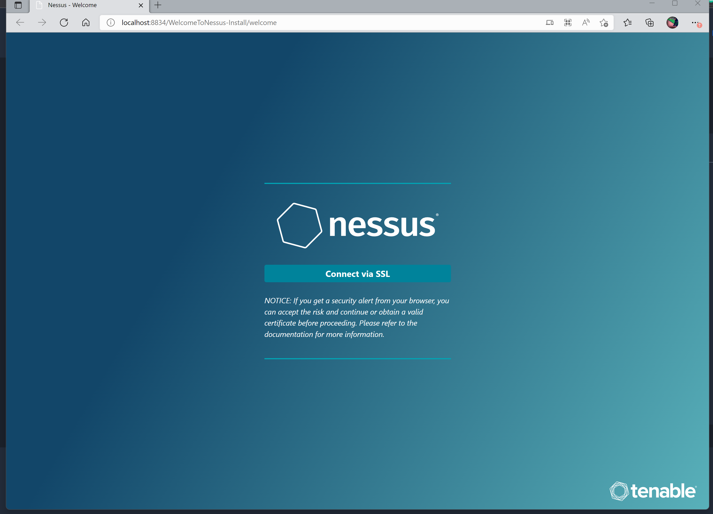
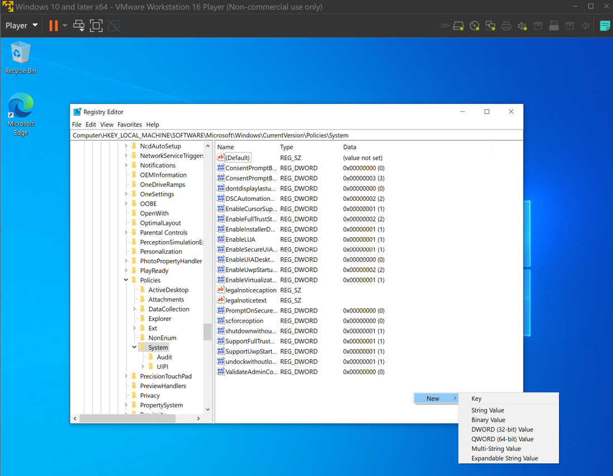
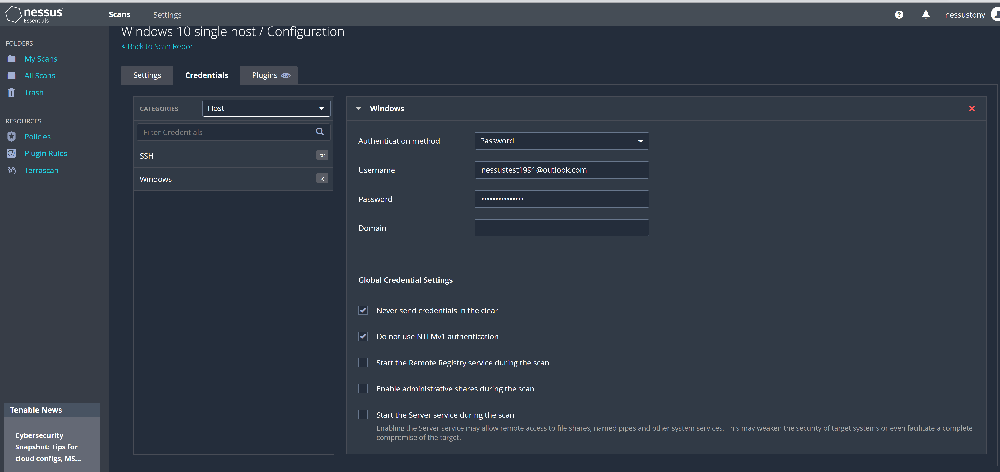

<!--
# Nessus
Nessus Vulnerability Management
-->

# Nessus Vulnerability Management | Scanning and Remediation

## Project Description

This project demonstrates how to create and manage a virtual environment using VMware and Nessus Essentials. The main objective is to perform vulnerability scans, both basic and credentialed, analyze the results, and apply remediation techniques. This showcases key steps in the Vulnerability Management Lifecycle.

## Project Objectives

1. Provisioning and deprovisioning virtual environments within VMware.
2. Running initial vulnerability scans using Nessus against VMs and observing results.
3. Running credentialed vulnerability scans and comparing/contrasting results.
4. Applying remediation techniques.

## Technologies and Protocols Used

- **VMware Workstation 16 Player**
- **Nessus Essentials**
- **Windows ISO** + **Firefox 3.6.12**

> **Note:** This lab will be conducted on a Windows machine.

## Useful Links

- [VMware Workstation Player](https://www.vmware.com/products/workstation-player/workstation-player-evaluation.html)
- [Nessus Essentials](https://www.tenable.com/products/nessus/nessus-essentials)
- [Windows 10 ISO](https://www.microsoft.com/en-us/software-download/windows10)

## Overview

## Step-by-Step Guide

### Step 1: Install Nessus Essentials

#### Step 1.1: Sign Up and Download Nessus Essentials

1. Register for an account on the [Nessus Essentials website](https://www.tenable.com/products/nessus/nessus-essentials).
2. You will receive an activation code via email.
3. Copy the activation code from your email.
4. Click on "Download Nessus" from the website.
5. Choose `Nessus > View Downloads`.
6. Select `Nessus - 8.15.6` under version.
7. Select `Windows - x86_64` under platform (ensure it includes Server 2012 R2, 7, 8, 10).
8. Open Tenable Nessus and follow the installation instructions.
9. After installation, a window with a localhost URL should pop up.
10. Copy/paste the URL for future use.

#### Step 1.2: Finish Nessus Installation

1. Click "Connect via SSL" on the web page.
2. On the warning page, click "Advanced" > "Continue to localhost" > "Nessus Essentials".
3. Skip getting an activation code (we already have ours).
4. Paste the activation code and click "Continue".
5. Create a username and password (remember these for future use).
6. Click "Submit" and wait for the download to complete.

## Step 2: Download Windows 10 ISO File

1. Go to the [Windows 10 ISO download page](https://www.microsoft.com/en-us/software-download/windows10).
2. Click "Download now" and open the downloaded file.
3. Accept the license terms and choose "Create installation media".
4. Finish the setup and select "ISO file".
5. Wait for the download to complete and click "Finish".

## Step 3: Download VMware Workstation 16 Player

1. Go to the [VMware Workstation Player download page](https://www.vmware.com/products/workstation-player/workstation-player-evaluation.html).
2. Download and install VMware Workstation 16 Player.

## Step 4: Set Up Virtual Machine

1. Open VMware Workstation.
2. Click `Player > File > New Virtual Machine`.
3. For the Installer disc image file (ISO), browse and select your Windows 10 ISO.
4. Click `Next`, `Next`, then accept the default maximum disk size.
5. Click on `Customize Hardware`.
6. Under `Customize Hardware`, set RAM to 4 GB.
7. Under Network Adapter, choose `Bridged`.
8. Click `Close` and then `Finish`.
9. Open your VM and follow the steps to install Windows.
10. **Remember your username and password** when you create an account.

## Step 5: Configure Virtual Machine

### Step 5.1: Initial Configuration

1. Let’s scan our VM to see if you get any response - later we’ll do a more powerful credential scan.
2. Go to your VM, search for `CMD` to open the command line.
3. Use `ipconfig` to get your IPv4 address.

### Step 5.2: Firewall Configuration

1. In your VM, search for `wf.msc` to open Windows Defender Firewall properties.
2. Under Domain Profile tab, Private Profile tab, and Public Profile tab, turn the firewalls OFF.

### Step 5.3: Check for Connectivity

1. On your **host** machine, open a command prompt.
2. Ping your VM's IP address obtained in the previous step.
3. With the firewalls turned off, you should receive a response indicating successful connectivity.

## Step 6: Basic Nessus Scan

1. Sign into Nessus Essentials.
2. Click "Create a new scan".
3. Under Vulnerabilities, choose "Basic Network Scan".
4. Name the scan `Windows 10 Single Host` and paste the VM's IP address in the targets field.
5. Leave the rest of the settings as default.
6. Click "Save". You should see the scan configuration on the next page.
7. Scroll over and click the play button to start the scan.
8. Wait for the scan to complete.

## Step 7: Basic Scan Results

1. Click on the completed scan to view detailed results.
2. The initial scan might not return much information but will still provide some interesting fields.

3. Click on the "Vulnerabilities" tab to see identified issues.
4. You may find one medium severity vulnerability and several informational vulnerabilities.

5. When you click on the medium severity vulnerability, you may find “SMB Signing not required”.
6. Nessus provides a description and solution for this vulnerability.

> Next, we will configure our VM for a stronger, credentialed scan to uncover more vulnerabilities.

### Step 5.3: Check for Connectivity

1. On your **host** machine, open a command prompt.
2. Ping your VM's IP address obtained in the previous step.
3. With the firewalls turned off, you should receive a response indicating successful connectivity.

## Step 6: Basic Nessus Scan

1. Sign into Nessus Essentials.
2. Click "Create a new scan".
3. Under Vulnerabilities, choose "Basic Network Scan".
4. Name the scan `Windows 10 Single Host` and paste the VM's IP address in the targets field.
5. Leave the rest of the settings as default.
6. Click "Save". You should see the scan configuration on the next page.
7. Scroll over and click the play button to start the scan.
8. Wait for the scan to complete.

## Step 7: Basic Scan Results

1. Click on the completed scan to view detailed results.
2. The initial scan might not return much information but will still provide some interesting fields.

3. Click on the "Vulnerabilities" tab to see identified issues.
4. You may find one medium severity vulnerability and several informational vulnerabilities.

5. When you click on the medium severity vulnerability, you may find “SMB Signing not required”.
6. Nessus provides a description and solution for this vulnerability.

> Next, we will configure our VM for a stronger, credentialed scan to uncover more vulnerabilities.

## Step 8: Configuring VM for Credentialed Scan

### Step 8.1: Enable Remote Registry Service

1. On your VM, search for `services`.
2. Find and click `Remote Registry`.
3. Under Startup type, choose `Automatic`.
4. Click `Apply` and then `Start`.
5. This will allow Nessus to **crawl** through our VM registry and perform a more thorough scan.

### Step 8.2: Change User Account Control Settings

1. Search for `User Account Control`.
2. Change the setting to `Never Notify`.

> **Note:** These settings are not recommended in any other context; they are just for demo and lab purposes.

### Step 8.3: Add Registry Key for Enhanced Connectivity

1. Search for `Registry Editor`.
2. Navigate to `LOCAL_MACHINE > SOFTWARE > Microsoft > Windows > CurrentVersion > Policies > System`.
3. Right-click under `System` and create a new `DWORD (32-bit) Value`.
4. Name it `LocalAccountTokenFilterPolicy`.
5. Double-click it and set the value to `1`.
6. Restart your VM.

## Step 9: Configure Credentialed Scan on Nessus

### Step 9.1: Set Up Credentials in Nessus

1. Back in Nessus, select our original scan and click `More` at the top, then choose `Configure`.
2. Under the `Credentials` tab, select `Windows`.
3. Ensure that `Password` is selected and enter your VM's username and password.
4. Go back to `My Scans` and hit the play button to run the credentialed scan.

