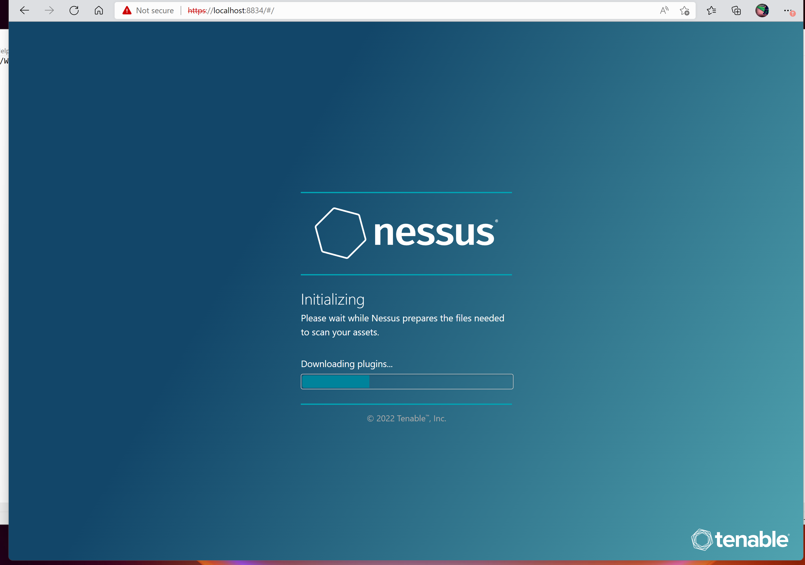

<!--
# Nessus
Nessus Vulnerability Management
-->

# Nessus Vulnerability Management | Scanning and Remediation

## Project Description

This project demonstrates how to create and manage a virtual environment using VMware and Nessus Essentials. The main objective is to perform vulnerability scans, both basic and credentialed, analyze the results, and apply remediation techniques. This showcases key steps in the Vulnerability Management Lifecycle.

## Project Objectives

1. Provisioning and deprovisioning virtual environments within VMware.
2. Running initial vulnerability scans using Nessus against VMs and observing results.
3. Running credentialed vulnerability scans and comparing/contrasting results.
4. Applying remediation techniques.

## Technologies and Protocols Used

- **VMware Workstation 16 Player**
- **Nessus Essentials**
- **Windows ISO** + **Firefox 3.6.12**

> **Note:** This lab will be conducted on a Windows machine.

## Useful Links

- [VMware Workstation Player](https://www.vmware.com/products/workstation-player/workstation-player-evaluation.html)
- [Nessus Essentials](https://www.tenable.com/products/nessus/nessus-essentials)
- [Windows 10 ISO](https://www.microsoft.com/en-us/software-download/windows10)

## Overview

## Step-by-Step Guide

### Step 1: Install Nessus Essentials

#### Step 1.1: Sign Up and Download Nessus Essentials

1. Register for an account on the [Nessus Essentials website](https://www.tenable.com/products/nessus/nessus-essentials).
2. You will receive an activation code via email.
3. Copy the activation code from your email.
4. Click on "Download Nessus" from the website.
5. Choose `Nessus > View Downloads`.
6. Select `Nessus - 8.15.6` under version.
7. Select `Windows - x86_64` under platform (ensure it includes Server 2012 R2, 7, 8, 10).
8. Open Tenable Nessus and follow the installation instructions.
9. After installation, a window with a localhost URL should pop up.
10. Copy/paste the URL for future use.

#### Step 1.2: Finish Nessus Installation

1. Click "Connect via SSL" on the web page.
2. On the warning page, click "Advanced" > "Continue to localhost" > "Nessus Essentials".
3. Skip getting an activation code (we already have ours).
4. Paste the activation code and click "Continue".
5. Create a username and password (remember these for future use).
6. Click "Submit" and wait for the download to complete.

